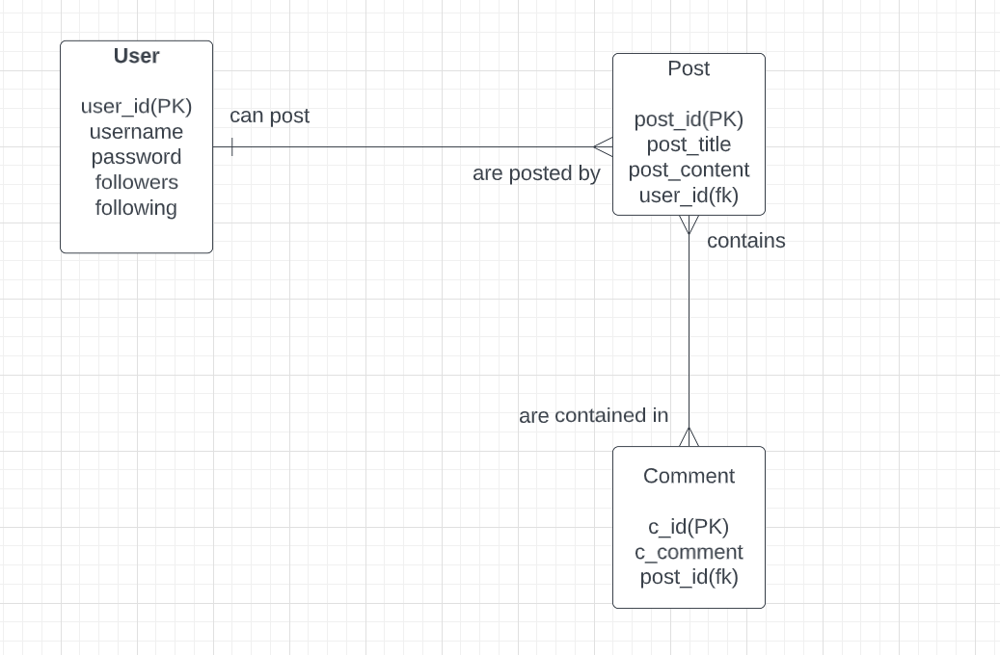

# Name :  Surya Teja Avadhanula
## Email ID : suryatejasharma@gmail.com

- I am Surya Teja an international student from India. I have done my undergraduate in Electronics and Communication Engineering (ECE) and currently pursuing master’s in Computer Sciences at SUNY New Paltz. Back in my undergrad, I have taken few courses related to Computer Sciences like C language, Computer Networks and Cryptography. Later I joined as software developer in Mindtree where I was part of a backend project working on Java, spring boot, MySQL and after that I switched onto a different project which dealt with HTML, CSS, jQuery, Ajax, ReactJS. I have pretty good knowledge over these technologies and willing to achieve more knowledge over frontend development.

- As of now I have taken the course UI/UX since I can foresee that there is a lot to learn about the frontend technologies. The era keeps on changing and new programming languages keep adding up on the frontend development. As mentioned to above technologies I wish I could learn more and deep which would help progress a lot ahead in my future professionally.

- I would be implementing a Social Media Platform almost similar to instagram(called FRIENDS) and below would be the rough ERD relationship diagram i have come up with.                                                                                                     

